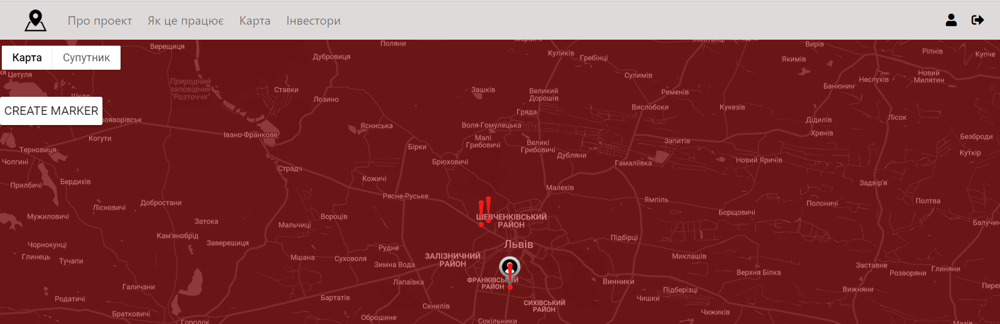
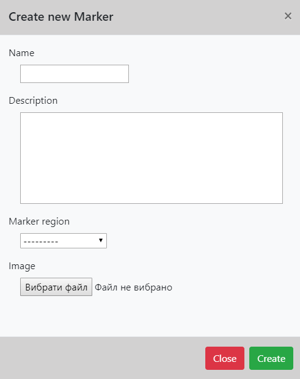
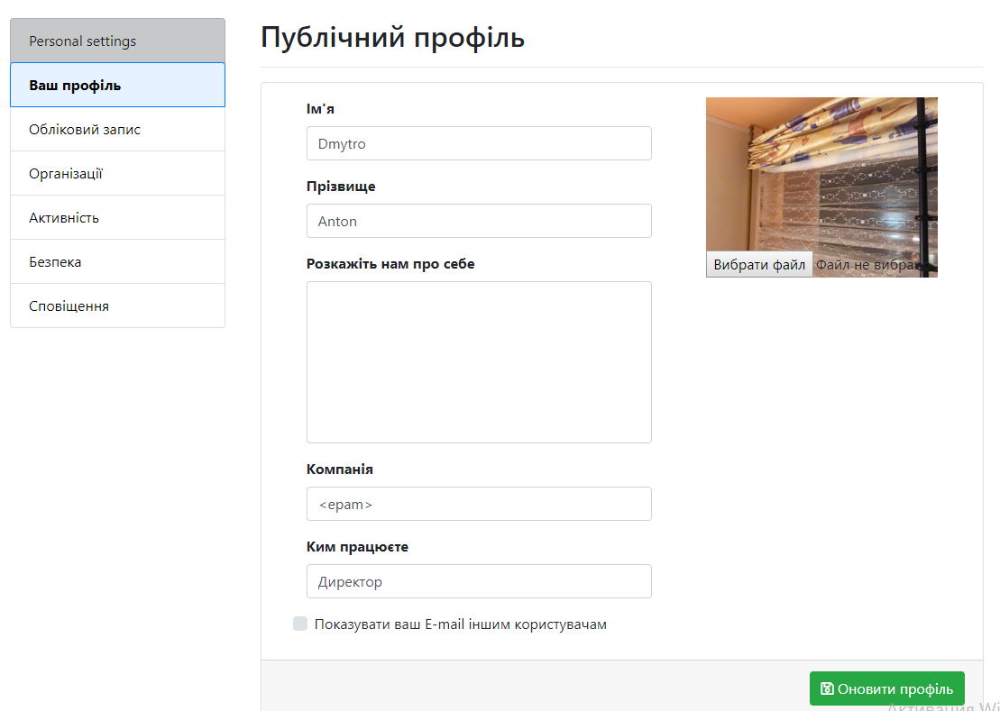

# UApp

The project’s purpose was to automate the process of sending reports concerning local problems to the city administrations. In general, people would publish their issues on the website, then the marker on the map is created, and the administration employee finds a way to solve the complaint.

Some of the features of the project
<h3> Landing page </h3>

<h3> Marker form </h3>

<h3> Marker information window </h3>

<h3> User profile</h3>

